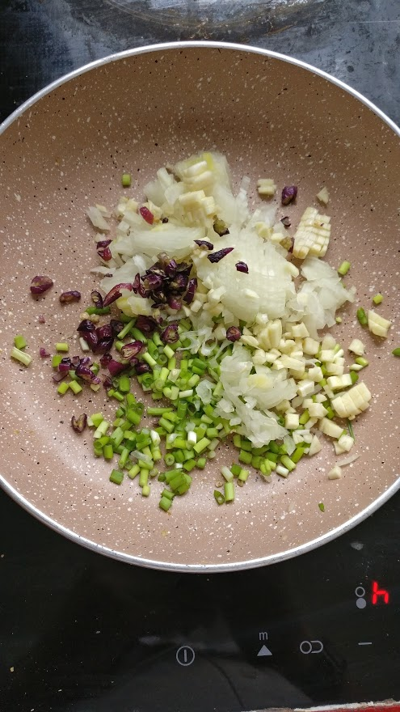
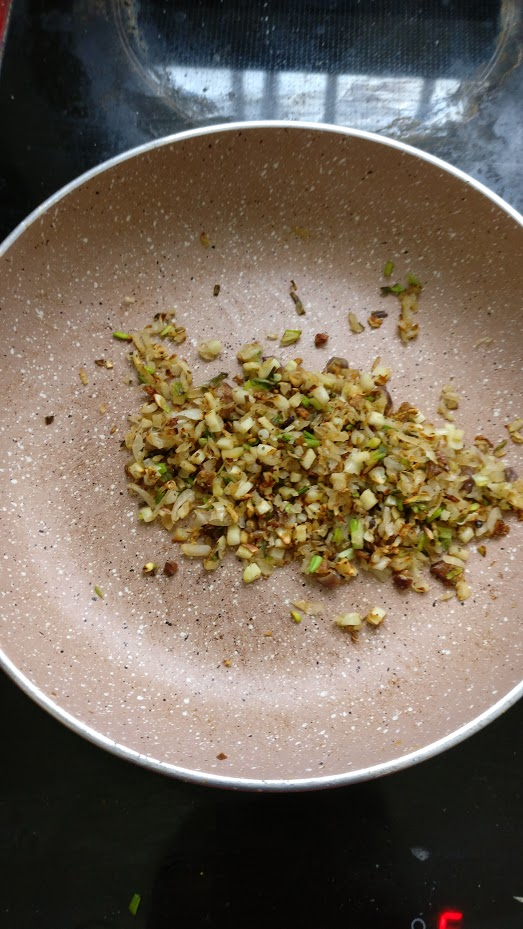
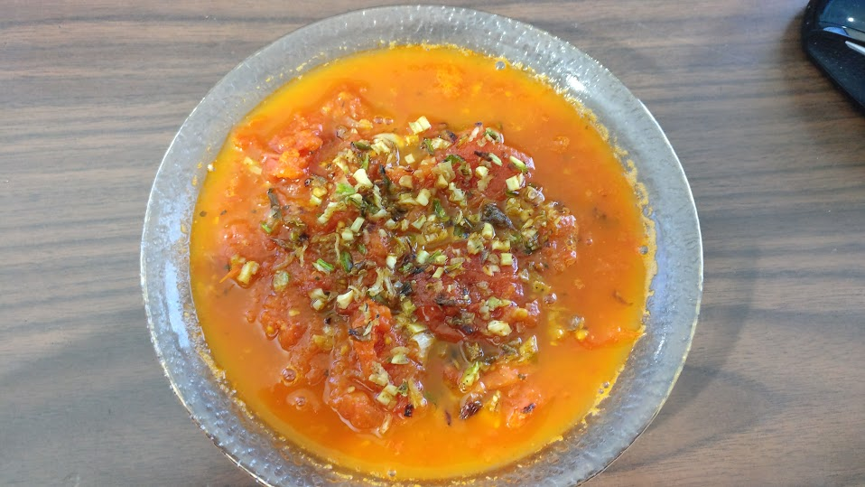

Title: Tomato Soup and Garnish
Published: 1/2/2018
Tags: [cooking, soups]
---
# Soup
- Heat up some olive oil in a pot.
- Toss in a bunch of soft tomatoes and/or cherry tomatoes.
    - Keep in mind that cherry tomatoes tend to be sweeter than regular ones.
- Spice with:
    - Salt
    - Black pepper
    - Basil
    - Oregano
- Cook over medium-low heat until there is the desired amount of liquid.
    - If you want a smoother soup, it can be blended once finished cooking.

Serve hot with rice, croutons, cheese of any kind, and/or a garnish.

# Garnish
## Ingredients
- Onion
- Garlic
- Scallions
- Hot peppers
- Salt
- Black pepper
- Oregano

## Instructions
Mince all the ingredients.

</img>

Fry (with no to little oil) until browned.

</img>

# End Result

</img>

